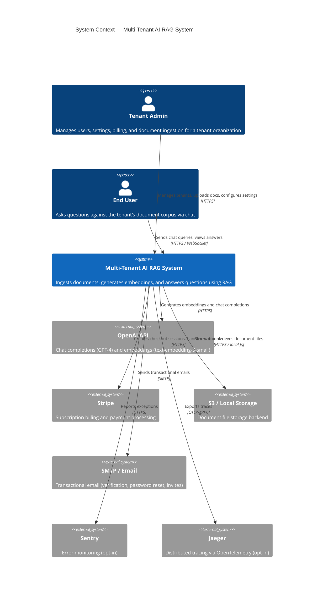
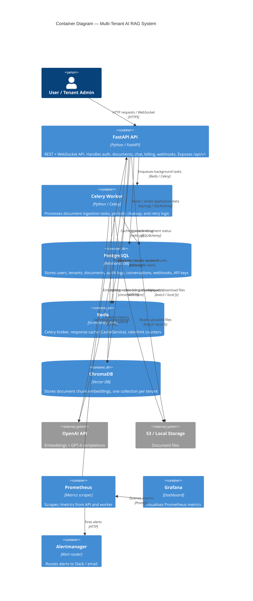
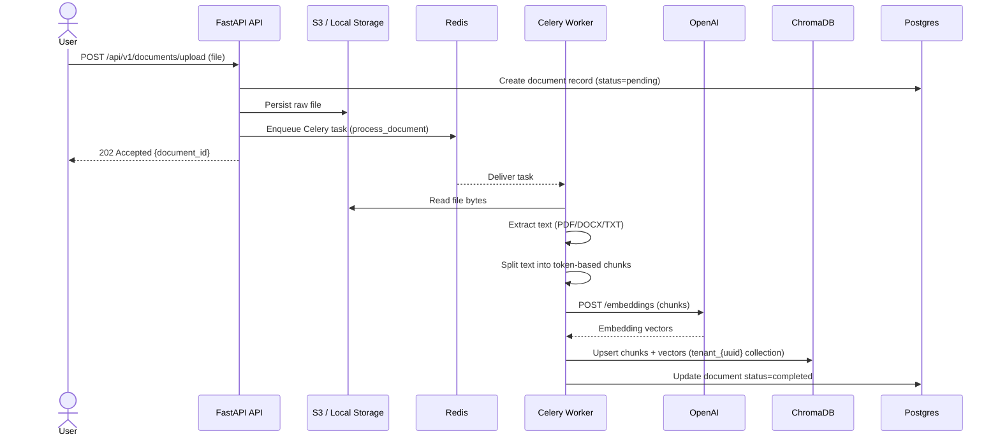
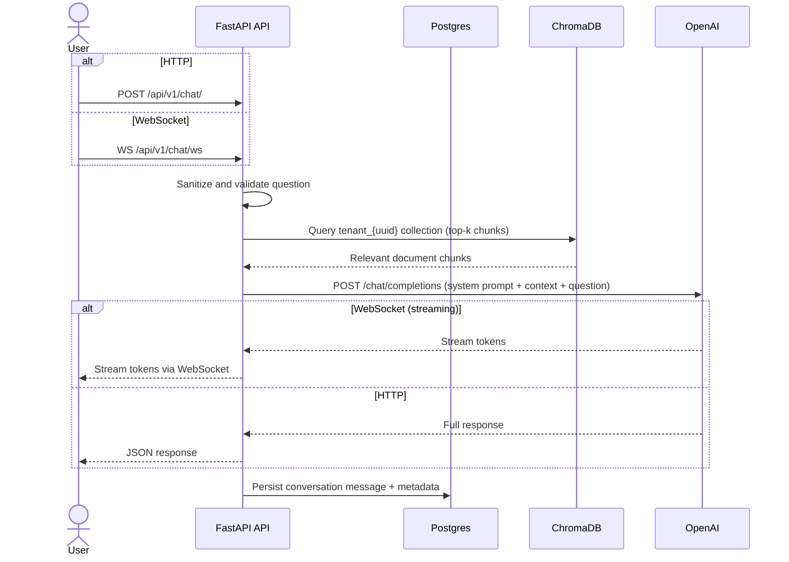

# Architecture — Multi-Tenant AI RAG System

This document describes the architecture of the Multi-Tenant AI RAG System (v0.5.0), a SaaS platform that lets organizations upload documents and query them via a Retrieval-Augmented Generation (RAG) pipeline backed by OpenAI GPT-4.

---

## C4 Context Diagram

Shows the system boundary and its relationships with external users and services.

---

## C4 Container Diagram

Shows every internal container and how they communicate.

---

## Document Upload Flow

---

## RAG Chat Query Flow

---

## Multi-Tenant Isolation

Every database table includes a `tenant_id` foreign key. All ORM queries append a `WHERE tenant_id = <current_tenant>` predicate enforced at the service layer — there is no cross-tenant data leakage by construction.

| Layer | Isolation mechanism |
|---|---|
| PostgreSQL | `tenant_id` column on every model; service-layer query filters |
| ChromaDB | Separate collection per tenant: `tenant_{uuid}` |
| Rate limiting | Counters keyed by `tenant_id` + `user_id` in Redis |
| API keys | Scoped to a single tenant; validated on every request |
| Audit logs | Written per tenant; accessible only to that tenant's admins |

GDPR account deletion purges all tenant data: PostgreSQL rows, ChromaDB collections, stored files, and cached values.

---

## Infrastructure & Deployment

### Local Development

Docker Compose brings up the full stack: `postgres`, `redis`, `chromadb`, `app` (FastAPI + Uvicorn), `worker` (Celery), and `pgadmin`. A single `docker compose up` is sufficient to run the system locally.

### Production (Kubernetes)

Kubernetes manifests (in `k8s/`) provide:

- **Namespace** isolation per environment
- **Deployments** for the API and Celery worker with **HPA** (Horizontal Pod Autoscaler) and **PDB** (Pod Disruption Budget)
- **StatefulSets** for PostgreSQL and ChromaDB with persistent volume claims
- **Ingress** with TLS termination
- **NetworkPolicies** limiting pod-to-pod traffic to declared paths only
- **SealedSecrets** for encrypted secret management in Git

### Observability

| Tool | Role |
|---|---|
| Prometheus | Scrapes `/metrics` from API and worker |
| Grafana | Pre-built dashboards for request rates, latency, error rates, queue depth |
| Alertmanager | Routes firing alerts to Slack and/or email |
| Jaeger | Distributed tracing via OpenTelemetry (opt-in via `ENABLE_TRACING=true`) |
| Sentry | Exception tracking and performance monitoring (opt-in via `SENTRY_DSN`) |
